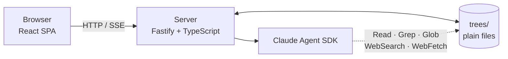

<div align="center">

# 🌳 Otago

**Learn by talking to Claude, in conversations that branch like a tree.**

Every question is a node. Branch off at any point, go deeper, rearrange the tree,
and keep everything as plain Markdown files you can commit to git.


</div>

---

## ✨ Features

- **Branching chats.** Each question and answer is a node. Ask a follow-up from any node to start a new branch.
- **Graph view.** Pan, zoom and click around the tree. Drag a node onto another node to move it.
- **Answers from your sources.** Upload `.md`, `.txt`, `.pdf` or e-books (`.epub`, `.fb2`, `.mobi`, `.azw3`, …). Claude searches them first and cites file and line numbers. It uses web search only when your sources don't cover the question.
- **Tree instructions.** Give each tree its own rules, e.g. *"Answer in Russian. Compare with C++."*
- **Attachments.** Claude can save files (images, SVG, tables, PDFs) to a node. You can preview them in the chat.
- **Node management.** Select one or many nodes, then delete them or move them together with their subtrees.
- **Model picker.** Choose the answer model per request (Opus, Sonnet, Fable, Haiku).
- **Themes.** Standard, Dark and Cool light.
- **Plain files only.** No database. The `trees/` folder is the whole state, so git is your backup.

## 🚀 Quick start

Requirements: **Node.js 22+**, **pnpm 10**, and a logged-in [Claude Code](https://claude.com/claude-code) (the server uses your local login).

```bash
pnpm install
pnpm dev
```

Open **http://127.0.0.1:5173**.

`pnpm dev` starts both apps through Turborepo:

| App | URL | Stack |
|---|---|---|
| `web` | `127.0.0.1:5173` | React 19, Vite, React Flow, TanStack Query |
| `server` | `127.0.0.1:3001` | Fastify 5, Zod, Claude Agent SDK |

Vite proxies `/api` to the server.

## 🧭 How it works



When you send a message at node `N`:

1. The server reads the chain `root → … → N` from disk.
2. It builds the prompt: system prompt + tree instructions + the chain + your message.
3. The Agent SDK runs inside the tree folder. It can read files but can't write them.
4. The answer streams to the browser over SSE.
5. On success, the server writes a new child node atomically. Haiku gives it a short kebab-case name.

Every request rebuilds context from files. You control context by shaping the tree: move or delete nodes.

## 📁 Data on disk

```
trees/
  rust-basics/                 # a tree
    tree.md                    # title + instructions
    sources/
      the-book-ch4.md
      rust-book.epub
      rust-book.epub.md        # text extracted on upload
    ownership/                 # a node = folder with node.md
      node.md
      attachments/             # files Claude saved for this node
      borrowing-rules/
        node.md
```

A node file is readable Markdown that renders fine on GitHub:

```md
---
created: 2026-09-23T10:00:00Z
model: claude-opus-5-5
---
<!-- otago:user -->
What is borrowing?

<!-- otago:assistant -->
Borrowing lets you reference a value without taking ownership [^1].

[^1]: sources/the-book-ch4.md:120-134
```

## ⚙️ Configuration

Set these in `server/.env` (see `server/.env.example`) or in your shell.

| Variable | Default | Purpose |
|---|---|---|
| `OTAGO_TREES_DIR` | `./trees` | Where trees live |
| `OTAGO_PORT` | `3001` | Server port |
| `OTAGO_MODEL` | `claude-opus-5-5` | Default answer model |
| `OTAGO_NAMING_MODEL` | `claude-haiku-4-5` | Model that names new nodes |
| `OTAGO_MODELS` | Opus, Sonnet, Fable, Haiku | Comma-separated models offered in the UI |
| `OTAGO_ALLOW_PRIVATE_URLS` | off | Let attachments download from loopback/private addresses |
| `OTAGO_API_URL` | `http://127.0.0.1:3001` | Web only (`web/.env`): where Vite proxies `/api` |

## 🛠 Scripts

Run from the repo root:

| Command | What it does |
|---|---|
| `pnpm dev` | Start server and web in watch mode |
| `pnpm build` | Build both packages |
| `pnpm test` | Run Vitest in both packages |
| `pnpm lint` | Biome check + `tsc --noEmit` |
| `pnpm format` | Format with Biome |
| `pnpm check` | Biome check with auto-fix |

Ask a question from the terminal without the UI (writes nothing to the tree):

```bash
pnpm --filter @otago/server ask <tree> "What is borrowing?" [parentNodeId]
```

## 🗂 Project layout

```
server/   Fastify API, storage layer, agent runner, e-book extraction
web/      React SPA: sidebar, graph, chat, source & attachment viewers
docs/     Design doc and backend stack
tasks/    v1 implementation tasks
```

## 📚 Docs

- [Design doc](docs/design.md): scope, file formats, API, UI
- [Backend stack](docs/backend-stack.md): libraries and decisions
- [Tasks](tasks/README.md): v1 roadmap

## 🔒 Scope and safety

- Runs **locally only** and binds to `127.0.0.1`. No auth and no multi-user support.
- The agent can use only `Read`, `Grep`, `Glob`, `WebSearch`, `WebFetch` and the `save_attachment` tool. Only the server writes files.
- Deleting a node is permanent. Commit `trees/` to git if you want history.
