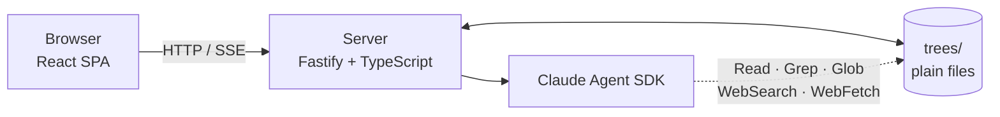

<div align="center">

# 🌳 Otago

**Learn by talking to Claude, in conversations that branch like a tree.**

Every question is a node. Branch off at any point, go deeper, rearrange the tree,
and keep everything as plain Markdown files you can commit to git.


</div>

---

## ✨ Features

- **Branching chats.** Each question and answer is a node. Ask a follow-up from any node to start a new branch.
- **Parallel questions.** Ask several questions at once, in one tree or many. Each one shows up as a pending node in the graph while Claude answers. Answers keep running in the background: reload the page or close the tab and come back later, the answer continues and the node appears when it is done. Cancel a running question, or retry a failed one (its attached files are kept).
- **Pending nodes.** Every question in flight is a box with a marching dashed outline under its node, titled with the question. Click it (or focus it and press Enter) to open its chat with the live answer; press Esc twice on a running box to cancel it. A failed answer turns red: open it to **Retry** (same text and files) or **Dismiss**. While answers run, structural edits are paused: the graph toolbar shows "N answering · Show…", which lists the running answers with **Open** / **Cancel** / **Cancel all**; a refused move, delete, rename, undo or tree rename offers to run again once nothing blocks it. The tree list shows a badge for trees with running answers and a red dot for failed ones.
- **Several asides.** Opening a new aside sends the previous one to the background; it keeps answering and is reopened from its pending box.
- **Graph view.** Pan, zoom and click around the tree. Drag a node onto another node to move it.
- **Answers from your sources.** Upload `.md`, `.txt`, `.pdf` or e-books (`.epub`, `.fb2`, `.mobi`, `.azw3`, …). Claude searches them first and cites file and line numbers. It uses web search only when your sources don't cover the question.
- **Tree instructions.** Give each tree its own rules, e.g. *"Answer in Russian. Compare with C++."*
- **Names in your language.** A new node is named after the question *and* the answer, in the answer's language (`правила-заимствования`, `regeln-der-ausleihe`). Folder names may contain letters of any script; tree folder names stay ASCII.
- **Attachments.** Claude can save files (images, SVG, tables, PDFs) to a node. You can preview them in the chat.
- **Node management.** Select one or many nodes, then delete them or move them together with their subtrees. Deletion is soft: the folder is renamed in place to `<name>.deleted-<timestamp>` and can be restored. Trash folders are hidden from the tree and the agent (permission deny rule, a tool hook and a prompt rule); they accumulate and can be removed by hand. Residual risk: an unscoped agent Grep over the whole tree may still print matches from trash folders if the SDK does not apply the deny rule to Grep output.
- **Undo.** Press Ctrl+Z (Cmd+Z on macOS) in the graph to undo the last move or delete. History is per tree, kept in the browser tab (sessionStorage, last 50 actions). No redo. Text fields keep their normal undo. While answers are running, undo opens the list of running answers instead.
- **Model picker.** Choose the answer model per request (Opus, Sonnet, Fable, Haiku).
- **Themes.** Standard, Dark and Cool light.
- **Plain files only.** No database. The `trees/` folder is the whole state, so git is your backup.

## 🚀 Quick start

Requirements: **Node.js 22+**, **pnpm 10**, and a logged-in [Claude Code](https://claude.com/claude-code) (the server uses your local login).

```bash
pnpm install
pnpm dev
```

Open **http://127.0.0.1:5173**.

`pnpm dev` starts both apps through Turborepo:

| App | URL | Stack |
|---|---|---|
| `web` | `127.0.0.1:5173` | React 19, Vite, React Flow, TanStack Query |
| `server` | `127.0.0.1:3001` | Fastify 5, Zod, Claude Agent SDK |

Vite proxies `/api` to the server.

## 🧭 How it works


```mermaid
flowchart LR
    B["Browser<br/>React SPA"] -- "HTTP / SSE" --> S["Server<br/>Fastify + TypeScript"]
    S --> A["Claude Agent SDK"]
    S <--> F[("trees/<br/>plain files")]
    A -. "Read · Grep · Glob<br/>WebSearch · WebFetch" .-> F
```

When you ask a question at node `N`:

1. The server reads the chain `root → … → N` from disk.
2. It builds the prompt: system prompt + tree instructions + the chain + your message.
3. The Agent SDK runs inside the tree folder. It can read files but can't write them.
4. The server registers the question and replies `202` right away. The answer streams to every open tab over one app-wide event stream (`GET /api/questions/events`, SSE); a reconnecting tab gets a snapshot of everything in flight.
5. When the answer is complete, Haiku names the node from the question and the answer, in the answer's language. The server then writes the new child node atomically. A failed answer writes nothing.

Every request rebuilds context from files. You control context by shaping the tree: move or delete nodes.

## 📁 Data on disk

```
trees/
  rust-basics/                 # a tree
    tree.md                    # title + instructions
    sources/
      the-book-ch4.md
      rust-book.epub
      rust-book.epub.md        # text extracted on upload
    ownership/                 # a node = folder with node.md
      node.md
      attachments/             # files Claude saved for this node
      borrowing-rules/
        node.md
```

A node file is readable Markdown that renders fine on GitHub:

```md
---
created: 2026-09-23T10:00:00Z
model: claude-opus-5-5
---
<!-- otago:user -->
What is borrowing?

<!-- otago:assistant -->
Borrowing lets you reference a value without taking ownership [^1].

[^1]: sources/the-book-ch4.md:120-134
```

## ⚙️ Configuration

Set these in `server/.env` (see `server/.env.example`) or in your shell.

| Variable | Default | Purpose |
|---|---|---|
| `OTAGO_TREES_DIR` | `./trees` | Where trees live |
| `OTAGO_PORT` | `3001` | Server port |
| `OTAGO_MODEL` | `claude-opus-5-5` | Default answer model |
| `OTAGO_NAMING_MODEL` | `claude-haiku-4-5` | Model that names new nodes |
| `OTAGO_MODELS` | Opus, Sonnet, Fable, Haiku | Comma-separated models offered in the UI |
| `OTAGO_ALLOW_PRIVATE_URLS` | off | Let attachments download from loopback/private addresses |
| `OTAGO_API_URL` | `http://127.0.0.1:3001` | Web only (`web/.env`): where Vite proxies `/api` |

## 🛠 Scripts

Run from the repo root:

| Command | What it does |
|---|---|
| `pnpm dev` | Start server and web in watch mode |
| `pnpm demo` | Start the browser-only demo (`127.0.0.1:5174`) |
| `pnpm build` | Build all packages (server, web, demo) |
| `pnpm test` | Run Vitest in all packages |
| `pnpm lint` | Biome check + `tsc --noEmit` |
| `pnpm format` | Format with Biome |
| `pnpm check` | Biome check with auto-fix |

Ask a question from the terminal without the UI (writes nothing to the tree):

```bash
pnpm --filter @otago/server ask <tree> "What is borrowing?" [parentNodeId]
```

## 🎪 Demo

`demo/` is the same UI as `web/`, built as a static site with no server and no Claude. Its
mock backend runs in the browser:

- A virtual file system holds the trees in the real on-disk format (`tree.md`, `node.md`,
  `sources/`, `attachments/`, `files/`) and is saved to `localStorage`.
- Questions stream simulated Lorem ipsum answers and become nodes, like real ones. A question
  with the word `fail` fails once, so you can try Retry.
- First visit opens the seed tree from `demo/seed/`. **Reset** in the bottom-left badge brings
  it back.
- Files are limited to 512 KB each (`localStorage` holds about 5 MB). E-books are not supported.

```bash
pnpm demo                                   # dev server on 127.0.0.1:5174
pnpm --filter @otago/demo build             # static site in demo/dist
```

To deploy on Vercel, create a project with **Root Directory** `demo`; `demo/vercel.json` has
the build settings. Keep "Include files outside the root directory" on (the default): the demo
imports `web/src` and `server/src/storage/node-names.ts`.

## 🗂 Project layout

```
server/   Fastify API, storage layer, agent runner, e-book extraction
web/      React SPA: sidebar, graph, chat, source & attachment viewers
demo/     The web UI with an in-browser mock backend, for static hosting
docs/     Design doc and backend stack
tasks/    v1 implementation tasks
```

## 📚 Docs

- [Design doc](docs/design.md): scope, file formats, API, UI
- [Backend stack](docs/backend-stack.md): libraries and decisions
- [Tasks](tasks/README.md): v1 roadmap

## 🔒 Scope and safety

- Runs **locally only** and binds to `127.0.0.1`. No auth and no multi-user support.
- The agent can use only `Read`, `Grep`, `Glob`, `WebSearch`, `WebFetch` and the `save_attachment` tool. Only the server writes files.
- Deleting a node is soft (see Node management) and can be undone. Commit `trees/` to git if you want history.
- Questions in flight live in server memory only: restarting the server loses running and failed questions (nothing half-written stays in `trees/`).
