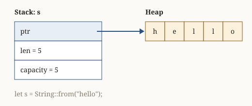

<!-- otago:user -->
Where do values live: on the stack or on the heap?

<!-- otago:assistant -->
Fixed-size values live on the **stack**. Data that can grow lives on the **heap**, and a small fixed-size handle to it sits on the stack[^1].

A `String` is the classic example: the stack holds three words (pointer, length, capacity), and the characters live on the heap.



That layout explains moves: `let t = s;` copies the three stack words and marks `s` as moved. The heap bytes are not touched, so moving a `String` is cheap no matter how long it is.

```rust
let s = String::with_capacity(10);
s.len();      // 0, stored on the stack
s.capacity(); // 10, stored on the stack
```

**Exercise:** print `std::mem::size_of::<String>()` on your machine. How does the number relate to the three words?

[^1]: sources/rust-ownership-notes.md:38-39
