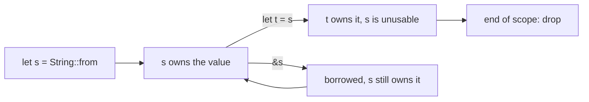

<!-- otago:user -->
What is ownership in Rust, in plain words?

<!-- otago:assistant -->
Ownership is how Rust frees memory without a garbage collector. The compiler tracks **who is responsible** for every value and frees the value when that owner is gone.

It comes down to three rules[^1]. Here they are:

1. Every value has exactly one owner, the variable that holds it.
2. There is only one owner at a time. Assigning or passing the value *moves* ownership.
3. When the owner goes out of scope, the value is dropped.

```rust
fn main() {
    let greeting = String::from("hello"); // `greeting` owns the String
    {
        let inner = String::from("scoped"); // `inner` owns this one
        println!("{inner}");
    } // `inner` goes out of scope: its String is freed here
    println!("{greeting}");
} // `greeting` is freed here
```

The life of a value looks like this:



All of these checks run at compile time, so they cost nothing at run time[^1].

**Exercise:** add `println!("{inner}");` right after the inner block. What error do you expect, and why?

[^1]: sources/rust-ownership-notes.md:5-9
